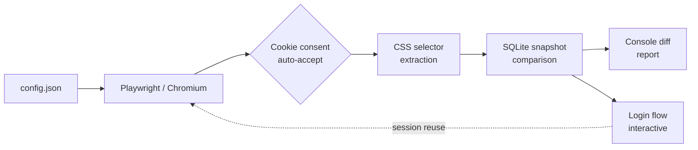

# Page Change Checker

[](https://github.com/tomassvensson/page-change-checker/actions/workflows/ci.yml)
[](https://github.com/tomassvensson/page-change-checker/actions/workflows/codeql.yml)
[](https://sonarcloud.io/summary/new_code?id=tomassvensson_page-change-checker)
[](https://sonarcloud.io/summary/new_code?id=tomassvensson_page-change-checker)
[](LICENSE)
[](https://nodejs.org/)
[](https://www.typescriptlang.org/)

**You care when a web page changes. This tool tells you when it does.**

Point it at any URL and a CSS selector. On every run it loads the page in a real Chromium browser, extracts the element text, compares it to the last saved snapshot in SQLite, and prints a diff if anything changed. No cloud account required—everything runs locally.

---

## Why this project exists

Most change-detection services are either SaaS (privacy concern, cost), too coarse (whole-page hash), or too brittle (regex on raw HTML). This project is a small but production-minded monitoring tool that:

- uses a **real browser** so JavaScript-rendered content, cookie banners, and session cookies all work,
- watches **specific elements** via CSS selectors rather than whole-page hashes,
- stores snapshots in a **local SQLite database** so you own your data,
- handles **login walls** interactively and reuses the session on later runs,
- ships with a **CI pipeline, type checking, linting, unit tests, integration tests, and E2E tests**.

It is intentionally a single-machine tool. If you need distributed monitoring, use it as a starting point.

---

## What problem it solves

| Situation                                     | Without this tool             | With this tool                                    |
| --------------------------------------------- | ----------------------------- | ------------------------------------------------- |
| A price dropped on a product you want         | You check manually every day  | You get a console diff the moment it changes      |
| A job posting you are watching disappears     | You notice days later         | The next scheduled run reports "selector missing" |
| A competitor updates their pricing page       | You only find out by accident | A diff shows exactly what changed                 |
| A legal or regulatory page is quietly amended | You may never know            | The diff is stored alongside a timestamp          |

---

## Use cases

- **Price monitoring** — watch a `<span class="price">` on a retailer or airline page and be notified the instant the price changes.
- **Job postings** — monitor a careers page for new or removed listings; the selector targets the listing container, so any addition or removal surfaces immediately.
- **Kleinanzeigen sellers** — watch a seller's profile page (e.g. `kleinanzeigen.de/pro/…`) for new or removed items using the item list selector.
- **Legal and regulatory pages** — track terms-of-service, privacy policies, or official regulatory announcements where even a single word change matters.
- **Competitor pages** — watch a competitor's feature list, pricing table, or announcement banner for quiet updates.

---

## Quick start

### Prerequisites

- [Node.js 20+](https://nodejs.org/)
- npm (included with Node.js)

### Linux / macOS

```bash
git clone https://github.com/tomassvensson/page-change-checker.git
cd page-change-checker
npm install
npx playwright install chromium --with-deps
cp config.example.json config.json
npm run seed
npm run scrape
```

### Windows (PowerShell)

```powershell
git clone https://github.com/tomassvensson/page-change-checker.git
cd page-change-checker
npm install
npx playwright install chromium --with-deps
Copy-Item config.example.json config.json
npm run seed
npm run scrape
```

The first `npm run scrape` creates the SQLite database and records baseline snapshots. The second run (and every run after) compares against those snapshots and reports diffs.

---

## Sample console output

### First run — establishing the baseline

On the very first `npm run scrape` (or after `npm run seed`) there is no previous snapshot to compare against. The tool records the current content and reports it as the baseline:

```
URL: https://www.example.com/product/abc
HTTP status: 200
Login necessary: no
Selector: span.price [0] mode=innerText exists=yes matches=1
  changed: no (first run — baseline recorded)
  content: €49.99
```

Every subsequent run compares against this baseline.

### Second run — no change detected

```
URL: https://www.example.com/product/abc
HTTP status: 200
Login necessary: no
Selector: span.price [0] mode=innerText exists=yes matches=1
  changed: no
  old: €49.99
```

### Change detected (with diff)

```
URL: https://www.example.com/product/abc
HTTP status: 200
Login necessary: no
Selector: span.price [0] mode=innerText exists=yes matches=1
  changed: yes
  old: €49.99
  new: €39.99
--- old
+++ new
@@ -1 +1 @@
-€49.99
+€39.99
```

### Selector missing

```
URL: https://careers.example.com/jobs
HTTP status: 200
Login necessary: no
Selector: li.job-listing [0] mode=innerText exists=no matches=0
  problem: selector did not match the requested element
```

### Login needed

```
URL: https://app.example.com/dashboard
HTTP status: 200
Login necessary: yes
Login check: div.user-avatar [0] exists=no matched=no
  after-login content: profile menu
Selector: h2.plan-name [0] mode=innerText exists=no matches=0
  problem: selector did not match the requested element
```

---

## Sample screenshot (screenshot-on-change)

When `screenshot.onChange` is enabled, a full-page PNG is captured every time content changes. The filename encodes the hostname, database row ID, and ISO timestamp so screenshots are sortable and traceable:

```
screenshots/
  www-example-com-3-2025-01-15T10-30-00-000Z.png
```

> A sample image will appear here once the project runs against a live page with `screenshot.onChange: true`.

---

## Architecture



Data flow on each run:

1. `config.json` is validated with Zod and loaded into memory.
2. Playwright opens a persistent Chromium profile (`data/user-data`) so session cookies survive between runs.
3. Cookie-consent banners are automatically dismissed if a matching button is found.
4. If a `loginChecks` selector is absent, the interactive login flow opens a visible browser window and waits for you to log in; the session is then saved for future runs.
5. Each watched CSS selector is extracted from the live DOM.
6. The extracted content is compared against the last snapshot stored in SQLite.
7. Changed, missing, or new selectors are printed as a unified diff.

---

## Features

- [x] Real Chromium browser via Playwright — renders JavaScript, handles SPAs
- [x] CSS selector targeting — watch specific elements, not whole pages
- [x] `innerText` or `innerHTML` comparison mode per selector
- [x] Persistent browser profile — cookies and local storage reused across runs
- [x] Automatic cookie-consent banner dismissal (configurable selectors and text regex)
- [x] Interactive login flow with configurable timeout; session is saved for later runs
- [x] SQLite snapshot storage — no external service, no cloud dependency
- [x] Unified diff output when content changes
- [x] Email, webhook (Slack / Discord / Teams / generic), and Telegram notifications for detected changes
- [x] Optional screenshot capture when content changes (`screenshot.onChange`)
- [x] Scheduler with configurable interval (`schedule.intervalHours`)
- [x] `initialLastContent` baseline — seed a known value without a live scrape
- [x] Single page load per URL per run, even with multiple watched selectors
- [x] Full quality pipeline: TypeScript, ESLint, Prettier, Vitest, Playwright E2E, SonarCloud

---

## Configuration

Copy `config.example.json` to `config.json` and edit it. The file is validated on startup using Zod.

### Top-level options

| Key                            | Type      | Default                             | Description                                                                        |
| ------------------------------ | --------- | ----------------------------------- | ---------------------------------------------------------------------------------- |
| `databasePath`                 | `string`  | `"data/page-change-checker.sqlite"` | Path to the SQLite database file. Created automatically on first run.              |
| `normalize.trimWhitespace`     | `boolean` | `true`                              | Strip leading/trailing whitespace from extracted content before comparing.         |
| `normalize.collapseWhitespace` | `boolean` | `true`                              | Collapse runs of whitespace to a single space.                                     |
| `normalize.caseInsensitive`    | `boolean` | `false`                             | Lower-case content before comparing.                                               |
| `retry.maxAttempts`            | `number`  | `3`                                 | Maximum number of scrape attempts per URL before giving up.                        |
| `retry.baseDelayMs`            | `number`  | `1000`                              | Initial retry delay in milliseconds.                                               |
| `retry.backoffFactor`          | `number`  | `2`                                 | Multiplier applied to delay on each successive retry (exponential backoff).        |
| `concurrency.global`           | `number`  | `3`                                 | Maximum number of URLs scraped simultaneously across all hosts.                    |
| `concurrency.perHost`          | `number`  | `1`                                 | Maximum number of simultaneous requests to any single host.                        |
| `rateLimit.minDelayMs`         | `number`  | `500`                               | Minimum pause between requests to the same host (milliseconds).                    |
| `rateLimit.maxDelayMs`         | `number`  | `2000`                              | Maximum pause (random jitter applied between min and max).                         |
| `browser`                      | object    | —                                   | Playwright browser launch and context options. See table below.                    |
| `schedule.intervalHours`       | `number`  | `24`                                | Hours between runs when using `npm run schedule`.                                  |
| `login.interactive`            | `boolean` | `true`                              | Open a visible browser window when a login wall is detected.                       |
| `login.waitTimeoutMs`          | `number`  | `600000`                            | Milliseconds to wait for you to complete login before timing out (default 10 min). |
| `screenshot.onChange`          | `boolean` | `false`                             | Capture a screenshot of the page when content changes.                             |
| `screenshot.dir`               | `string`  | `"screenshots"`                     | Directory where screenshots are saved (relative to cwd).                           |
| `notifications.onlyChanges`    | `boolean` | `true`                              | Send notifications only when at least one selector changed.                        |
| `notifications.email`          | object    | —                                   | SMTP email settings. Set `enabled: true` to activate.                              |
| `notifications.webhooks`       | array     | `[]`                                | List of webhook endpoints (Slack, Discord, Teams, or generic JSON).                |
| `notifications.telegram`       | object    | —                                   | Telegram bot settings. Set `enabled: true` to activate.                            |
| `urls`                         | array     | —                                   | List of pages to monitor. See table below.                                         |

### `browser` options

| Key                             | Type       | Description                                                                                    |
| ------------------------------- | ---------- | ---------------------------------------------------------------------------------------------- |
| `headless`                      | `boolean`  | Run browser without a visible window. Set to `false` to debug page loading.                    |
| `userDataDir`                   | `string`   | Path to the persistent Chromium profile directory. Stores cookies and local storage.           |
| `timeoutMs`                     | `number`   | Navigation timeout in milliseconds.                                                            |
| `waitUntil`                     | `string`   | Playwright navigation event: `"load"`, `"domcontentloaded"`, `"networkidle"`, or `"commit"`.   |
| `userAgent`                     | `string`   | Browser user-agent string sent with every request.                                             |
| `locale`                        | `string`   | Browser locale (e.g. `"de-DE"`). Affects `Accept-Language` and date formatting.                |
| `timezoneId`                    | `string`   | IANA timezone (e.g. `"Europe/Berlin"`).                                                        |
| `extraHTTPHeaders`              | object     | Additional HTTP headers added to every request.                                                |
| `cookieConsent.enabled`         | `boolean`  | Whether to attempt automatic cookie-consent banner dismissal.                                  |
| `cookieConsent.timeoutMs`       | `number`   | How long to wait for a consent button to appear (milliseconds).                                |
| `cookieConsent.buttonTextRegex` | `string`   | Regex matched against button text to identify accept buttons.                                  |
| `cookieConsent.cssSelectors`    | `string[]` | CSS selectors tried in order to click the consent button before falling back to text matching. |
| `viewport.width`                | `number`   | Default browser window width in pixels (default: `1280`).                                      |
| `viewport.height`               | `number`   | Default browser window height in pixels (default: `900`).                                      |

### `urls[]` options

| Key                                    | Type                           | Description                                                                                                              |
| -------------------------------------- | ------------------------------ | ------------------------------------------------------------------------------------------------------------------------ |
| `url`                                  | `string`                       | The page URL to load. Loaded once per run regardless of how many selectors are configured.                               |
| `enabled`                              | `boolean`                      | Set to `false` to skip this URL without removing it from config. Default `true`.                                         |
| `tags`                                 | `string[]`                     | Arbitrary labels used for grouping in reports (e.g. `["price", "de"]`).                                                  |
| `overrides.viewport`                   | object                         | Per-URL viewport override (`{ width, height }`).                                                                         |
| `selectors[]`                          | array                          | One or more elements to watch on this page.                                                                              |
| `selectors[].cssPath`                  | `string`                       | CSS selector for the element to watch.                                                                                   |
| `selectors[].elementIndex`             | `number`                       | Zero-based index when the selector matches multiple elements. Usually `0`.                                               |
| `selectors[].compareMode`              | `"innerText"` \| `"innerHTML"` | Whether to compare rendered text or raw HTML markup.                                                                     |
| `selectors[].name`                     | `string`                       | Optional human-readable label shown in reports instead of the raw CSS path.                                              |
| `selectors[].enabled`                  | `boolean`                      | Set to `false` to skip this selector. Default `true`.                                                                    |
| `selectors[].initialLastContent`       | `string`                       | Optional. Seed the baseline with a known value instead of waiting for the first live scrape. Inserted by `npm run seed`. |
| `selectors[].ignorePatterns`           | `string[]`                     | Regex strings stripped from content before comparison (removes timestamps, counters, ad IDs, etc.).                      |
| `selectors[].waitForSelector`          | `string`                       | Optional CSS selector to wait for before extracting content. Useful for lazy-loaded content.                             |
| `selectors[].waitForSelectorTimeoutMs` | `number`                       | Timeout for `waitForSelector` in milliseconds. Default `30000`.                                                          |
| `selectors[].normalizeOverride`        | object                         | Per-selector normalisation settings that override the top-level `normalize` config.                                      |
| `loginChecks[]`                        | array                          | Optional. Selectors expected to exist only after a successful login. If any are missing, `loginNeeded` is set to `true`. |
| `loginChecks[].cssPath`                | `string`                       | CSS selector for an element that only appears when logged in (e.g. avatar, username).                                    |
| `loginChecks[].elementIndex`           | `number`                       | Zero-based index, same as `selectors[].elementIndex`.                                                                    |
| `loginChecks[].compareMode`            | `"innerText"` \| `"innerHTML"` | Compare mode, same as selectors.                                                                                         |
| `loginChecks[].expectedContent`        | `string`                       | Optional. If provided, the element content must also match this value to count as logged in.                             |
| `loginChecks[].description`            | `string`                       | Optional. Human-readable label shown in the report next to the login check result.                                       |

### `notifications` options

| Key                                  | Type       | Default | Description                                                           |
| ------------------------------------ | ---------- | ------- | --------------------------------------------------------------------- |
| `notifications.onlyChanges`          | `boolean`  | `true`  | Send notifications only when at least one monitored selector changed. |
| `notifications.email.enabled`        | `boolean`  | `false` | Activate email notifications.                                         |
| `notifications.email.from`           | `string`   | —       | Sender address.                                                       |
| `notifications.email.to`             | `string[]` | —       | Recipient addresses.                                                  |
| `notifications.email.subject`        | `string`   | —       | Email subject line.                                                   |
| `notifications.email.smtp.host`      | `string`   | —       | SMTP server hostname.                                                 |
| `notifications.email.smtp.port`      | `number`   | —       | SMTP port (e.g. `587` for STARTTLS, `465` for SSL).                   |
| `notifications.email.smtp.secure`    | `boolean`  | `false` | Use TLS from the start (set `true` for port 465).                     |
| `notifications.email.smtp.auth.user` | `string`   | —       | SMTP username.                                                        |
| `notifications.email.smtp.auth.pass` | `string`   | —       | SMTP password. Keep this out of version control.                      |
| `notifications.webhooks[].enabled`   | `boolean`  | `false` | Activate this webhook endpoint.                                       |
| `notifications.webhooks[].url`       | `string`   | —       | Webhook URL (Slack, Discord, Teams, or any HTTP endpoint).            |
| `notifications.webhooks[].format`    | `string`   | —       | Payload format: `"slack"`, `"discord"`, `"teams"`, or `"generic"`.    |
| `notifications.webhooks[].headers`   | `object`   | `{}`    | Extra HTTP headers (e.g. `Authorization: Bearer …`).                  |
| `notifications.telegram.enabled`     | `boolean`  | `false` | Activate Telegram notifications.                                      |
| `notifications.telegram.botToken`    | `string`   | —       | Telegram Bot API token.                                               |
| `notifications.telegram.chatId`      | `string`   | —       | Target chat or channel ID (prefix with `-100` for channels).          |
| `notifications.telegram.onlyChanges` | `boolean`  | `true`  | Override `onlyChanges` for Telegram only.                             |

---

## Running on a schedule

Set `schedule.intervalHours` in `config.json`, then:

```bash
npm run schedule
```

For persistent operation, wrap this in your OS process manager:

**Linux (systemd)**

```ini
# /etc/systemd/system/page-change-checker.service
[Unit]
Description=Page Change Checker

[Service]
WorkingDirectory=/opt/page-change-checker
ExecStart=/usr/bin/npm run schedule
Restart=on-failure

[Install]
WantedBy=multi-user.target
```

```bash
sudo systemctl enable --now page-change-checker
```

**macOS (launchd)**

```xml
<!-- ~/Library/LaunchAgents/com.page-change-checker.plist -->
<key>ProgramArguments</key>
<array>
  <string>/usr/local/bin/npm</string>
  <string>run</string>
  <string>schedule</string>
</array>
```

**Windows (Task Scheduler)**

```powershell
$action  = New-ScheduledTaskAction -Execute "npm" -Argument "run schedule" -WorkingDirectory "C:\path\to\page-change-checker"
$trigger = New-ScheduledTaskTrigger -AtStartup
Register-ScheduledTask -TaskName "PageChangeChecker" -Action $action -Trigger $trigger
```

---

## Login flow

If a page requires login:

1. Add `loginChecks` selectors to the URL entry in `config.json` — elements that only exist when you are logged in (e.g. an avatar or username element).
2. Set `login.interactive` to `true`.
3. On the first run, if the login checks are missing, a **visible** Chromium window opens for that host.
4. Log in normally in that window. The scraper detects the login check selector appearing and continues automatically.
5. The session (cookies, local storage) is saved to `data/user-data` and reused on every subsequent run.

Set `login.waitTimeoutMs` to control how long the tool waits before giving up (default: 10 minutes).

---

## Developer docs

### Project structure

```
src/
  cli/
    index.ts       CLI entry point (seed / run / schedule commands)
    config.ts      Zod schema and config loader
    scheduler.ts   Interval loop with overlap prevention
  browser/
    scraper.ts     Playwright orchestration, retry, concurrency, rate limiting
    pageReader.ts  Low-level DOM extraction via Playwright
  storage/
    db.ts          SQLite helpers (open, migrate, seed, snapshots, resolveUrls)
  reporting/
    reporter.ts    Formats results as a human-readable diff report
  notifications/
    index.ts       Orchestrates all notification channels
    email.ts       SMTP email via nodemailer
    webhook.ts     HTTP webhooks (Slack, Discord, Teams, generic JSON)
    telegram.ts    Telegram Bot API
  core/
    types.ts       Shared TypeScript interfaces
    errors.ts      Structured error types (NavigationTimeout, Http, SelectorMissing…)
    normalize.ts   Text normalisation and ignore-pattern logic
tests/
  unit/          Vitest unit tests (config, pageReader, reporter)
  integration/   Vitest integration tests (db)
  e2e/           Playwright E2E tests (scraper against a local HTML fixture)
docs/
  architecture.md  Module diagram and data flow
  configuration.md Full config reference
  development.md   Dev setup, testing, project conventions
  operations.md    Systemd / launchd / Task Scheduler guides
```

See [docs/architecture.md](docs/architecture.md) for the full module diagram.

### Available scripts

| Script                  | Description                                                 |
| ----------------------- | ----------------------------------------------------------- |
| `npm run seed`          | Insert or update database rows from `config.json`           |
| `npm run scrape`        | Run one scrape and print the report                         |
| `npm run schedule`      | Run immediately, then repeat every `schedule.intervalHours` |
| `npm run build`         | Compile TypeScript to `dist/`                               |
| `npm run lint`          | ESLint                                                      |
| `npm run format`        | Prettier (write)                                            |
| `npm run format:check`  | Prettier (check only)                                       |
| `npm run test`          | Vitest unit + integration tests                             |
| `npm run test:coverage` | Vitest with V8 coverage                                     |
| `npm run test:e2e`      | Playwright E2E tests                                        |
| `npm run verify:static` | Lint + format check + build                                 |
| `npm run verify`        | Full pipeline: static + coverage + E2E                      |

### Git hooks (Husky)

Installed automatically by `npm install` via the `prepare` script.

| Hook         | Checks                                              |
| ------------ | --------------------------------------------------- |
| `pre-commit` | Lint, format check, build, unit + integration tests |
| `pre-push`   | Full `npm run verify` (includes coverage and E2E)   |

To reinstall hooks manually:

```bash
npm run prepare
```

### Running tests

```bash
# Unit and integration tests
npm run test

# With coverage report
npm run test:coverage

# E2E tests (requires Playwright Chromium to be installed)
npm run test:e2e

# Full pipeline
npm run verify
```

---

## Demo scope

This is a focused, single-machine monitoring tool intentionally kept small. It is **not** an unfinished SaaS product.

Out of scope by design:

- No web UI or dashboard
- No multi-user support or authentication layer
- No distributed worker pool or message queue
- No cloud deployment (though see [docs/operations.md](docs/operations.md) for systemd / launchd setup)

Notifications (email, webhooks, Telegram) are included, but they are opt-in and not the primary interface — the tool is designed to be run from the command line and piped into whatever alerting pipeline you already have. If you need a web dashboard or distributed workers, use this project as a starting point.

---

## Limitations

- **Notifications are best-effort** — email, webhook, and Telegram delivery errors are logged but do not abort the scrape run. For critical alerting, treat the console output as the authoritative record and use notifications as a convenience layer.
- **Single machine** — there is no distributed queue or worker pool. One Chromium process runs all URLs sequentially.
- **No scheduling persistence** — if the process restarts, the interval timer resets. Use a real OS scheduler (systemd, launchd, Task Scheduler) for reliability.
- **CSS selectors can break** — if a site redesigns its DOM, selectors need to be updated manually. There is no automatic selector healing.
- **Login automation is manual** — the interactive login flow requires a human to log in once. Automated form-filling is not supported by design (avoids credentials in config files).
- **No rendering timeout per selector** — if a page never finishes loading, the navigation timeout (`browser.timeoutMs`) applies but there is no per-selector wait strategy beyond what Playwright's `waitUntil` provides.
- **SQLite only** — the snapshot store is a local SQLite file. There is no support for Postgres, MySQL, or any remote store.

---

## Legal notice

This tool uses a real browser to load web pages you configure. Before pointing it at any URL:

- **Check the site's `robots.txt`** — respect `Disallow` rules that apply to automated agents.
- **Read the Terms of Service** — many sites prohibit automated scraping or monitoring. Using this tool in violation of a site's ToS is your responsibility.
- **Apply rate limiting** — use `rateLimit.minDelayMs` / `maxDelayMs` and `concurrency.perHost` to avoid hammering servers. The defaults are intentionally conservative.
- **Do not scrape personal data** — extracting information about individuals without their consent may violate GDPR, CCPA, or equivalent regulations in your jurisdiction.
- **Only monitor pages you are authorised to access** — do not use this tool to access systems without permission.

The authors of this project accept no liability for how it is used.

---

## License

MIT. See [LICENSE](LICENSE).
