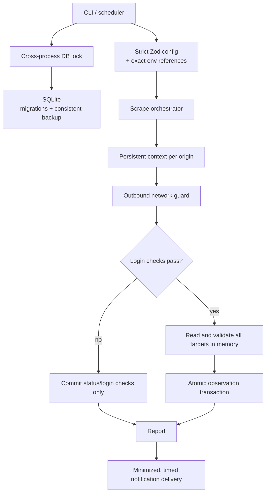

# Architecture

## Runtime components



The application is deliberately a local CLI. It exposes no HTTP server and has
no multi-user authentication database. Its primary security boundary is between
trusted operator configuration and untrusted monitored pages/endpoints.

## Observation lifecycle

1. The CLI acquires an exclusive stale-aware lock next to the configured
   database. A second process fails fast instead of racing SQLite and browser
   profile state.
2. Config is parsed with strict schemas. Only HTTP(S) URLs are accepted;
   embedded credentials, unknown fields, duplicates, invalid/unsafe regexes,
   header injection, and inconsistent interactive-login settings are rejected.
3. Config is authoritative: removed URLs and selectors are disabled, and stale
   login checks are removed.
4. URLs are grouped by origin. Each origin gets its own persistent Chromium
   context and profile directory.
5. Global and per-origin concurrency limits are enforced. Start times for the
   same origin are jittered by the configured rate limit.
6. Every navigation, redirect, and subresource passes through `NetworkGuard`.
   Private/reserved destinations are blocked unless explicitly permitted.
   Custom browser headers are merged only for the exact target origin.
7. HTTP status is checked before DOM extraction. Login checks run before
   watched selectors; a logged-out page cannot update target snapshots.
8. All watched selectors are evaluated in memory. Missing/malformed selectors,
   network-policy violations, and oversized content invalidate the observation.
9. URL status, login-check state, and every target snapshot are written in one
   transaction. Row-count assertions turn stale IDs into rollback-triggering
   failures.
10. Reports go to stdout; structured, redacted logs go to stderr. Third-party
    notifications default to summary-only content and omit local paths.
11. `SIGINT`/`SIGTERM` abort pending waits, close browser contexts, wait for the
    active run, close SQLite, and release the process lock.

## Storage and migrations

```text
urls
  id, url (unique), enabled, last_http_status, last_checked_at, tags

watch_targets
  id, url_id -> urls.id, name, css_path, element_index,
  compare_mode, last_content, enabled

login_checks
  id, url_id -> urls.id, css_path, element_index, compare_mode,
  expected_content, description, last_seen_content, last_matched

schema_migrations
  version, applied_at
```

SQLite uses foreign keys and WAL mode. Before a migration changes an existing
application schema, `VACUUM INTO` creates a transactionally consistent backup
that includes committed WAL state. The backup is reopened read-only and checked
with `PRAGMA integrity_check` before migration proceeds. All migration DDL and
version recording then execute in one transaction.

## Error and retry model

`PageChangeCheckerError` carries a machine-readable `errorType`:

```text
navigation_timeout
http_error
selector_missing
login_missing
network_policy
comparison_error
unknown
```

Retry decisions are typed rather than based only on message text. HTTP 408,
429, and 5xx responses, navigation timeouts, and unknown transient browser
failures may retry with capped exponential backoff. Login, selector,
network-policy, comparison, and other permanent failures do not.

## Verification strategy

- Unit tests cover strict config parsing, network ranges (including
  IPv4-mapped IPv6), redaction, locks, retries, reporting, scheduling, and
  notification minimization.
- SQLite integration tests prove WAL-consistent backups, authoritative
  reconciliation, row-count validation, and transaction rollback.
- A shared real-Chromium scenario suite runs under both Vitest/V8 coverage and
  Playwright. It proves that logged-out pages, HTTP 500 pages, malformed later
  selectors, and oversized content preserve baselines, and that
  `Authorization` never crosses origin.
- CI additionally runs a production dependency audit, immutable third-party
  action revisions, CodeQL, SonarCloud (when configured), and a non-root Docker
  smoke test.
