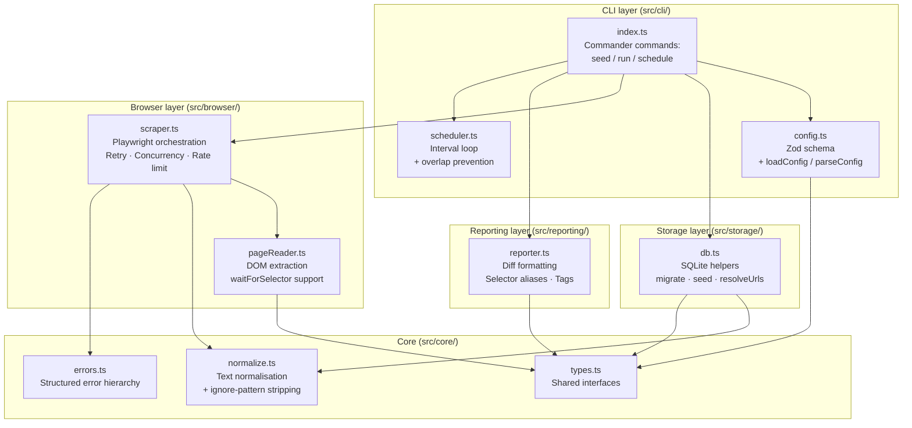

# Architecture

## Module diagram



## Data flow on each `run`

```
config.json
    │
    ▼
loadConfig()          Validate with Zod; apply defaults
    │
    ▼
openDatabase()        Open SQLite; run additive migrations
    │
    ▼
resolveUrls()         Merge DB state with config overrides
    │                 (enabled flags, tags, normalise, ignorePatterns, viewport)
    ▼
scrapeAll()
  ├─ Group URLs by hostname
  ├─ Acquire global semaphore (concurrency.global)
  ├─ Acquire per-host semaphore (concurrency.perHost)
  ├─ jitteredDelay()           Random pause between requests (rate limiting)
  └─ scrapeWithRetry()
       ├─ Launch Playwright persistent context
       ├─ Set viewport (global or per-URL override)
       ├─ navigate()
       ├─ cookieConsent()      Auto-click accept buttons
       ├─ loginCheck()         Detect login walls
       ├─ for each selector:
       │    readElementContent()    DOM extraction (+ waitForSelector)
       │    processContent()        Strip ignorePatterns, then normalise
       │    compare vs. snapshot    Detect change
       │    updateTargetContent()   Write new snapshot to SQLite
       └─ UrlScrapeResult[]
    │
    ▼
formatResults()       Render unified diffs to stdout
```

## Error hierarchy

```
PageChangeCheckerError (base)
├─ NavigationTimeoutError   — page.goto() timed out
├─ HttpError                — HTTP 4xx / 5xx response (.status)
├─ SelectorMissingError     — waitForSelector or required element not found
├─ LoginMissingError        — login check selector absent after page load
└─ ComparisonError          — unexpected error during snapshot comparison
```

`classifyError(error)` maps any thrown error to the `ErrorType` enum for structured
reporting.

## Persistence model

```
urls
  id        INTEGER PRIMARY KEY
  url       TEXT UNIQUE
  tags      TEXT (JSON array, nullable)
  enabled   INTEGER NOT NULL DEFAULT 1
  status    TEXT
  lastChecked TEXT

watch_targets
  id              INTEGER PRIMARY KEY
  url_id          INTEGER → urls.id
  css_path        TEXT
  element_index   INTEGER
  compare_mode    TEXT
  name            TEXT (nullable)
  enabled         INTEGER NOT NULL DEFAULT 1
  last_content    TEXT
  last_changed    TEXT

login_checks
  id              INTEGER PRIMARY KEY
  url_id          INTEGER → urls.id
  css_path        TEXT
  element_index   INTEGER
  compare_mode    TEXT
  expected_content TEXT (nullable)
  description     TEXT (nullable)
  last_result     TEXT
  last_checked    TEXT
```

New columns are added with `addColumnIfMissing()` so existing databases are
migrated non-destructively.
